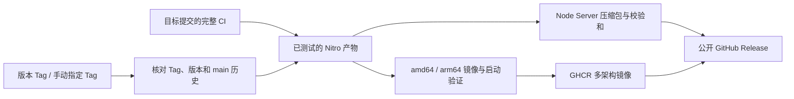

# OpenAPI Platform 发布流程

本文说明 `openapi-platform` 的版本、Git Tag、GitHub Release、GHCR 镜像和生产部署流程。`openapi-service` 使用独立仓库、版本和发布流水线；两者可以独立发布，版本号不建立对应关系。

## 1. 发布产物

Platform 不发布 npm 包。正式部署物包括：

- GitHub Release 中可直接执行 `npm start` 的预构建 Node Server 产物。
- GHCR 中的 amd64/arm64 容器镜像。

构建必须在 Linux CI 或开发机完成。生产服务器不执行 `pnpm install`、Nuxt build 或 Docker build。

## 2. 发布通道

| Git 事件 | GitHub Release | GHCR 镜像 | 用途 |
| --- | --- | --- | --- |
| 推送到 `main` | 不创建 | `latest`、`latest-amd64`、`latest-arm64` | 开发主线 |
| 推送 `vX.Y.Z` | 正式 Release | `X.Y.Z` 多架构与架构标签 | 正式生产版本 |
| 推送 `vX.Y.Z-rc.N` | Prerelease | 对应预发布标签 | 发布候选版本 |

生产环境应固定版本号或镜像 digest，不长期依赖会变化的 `latest`。

## 3. 版本规则

项目使用 [Semantic Versioning](https://semver.org/)：

| 变更 | 版本选择 |
| --- | --- |
| 不兼容的公开行为、数据库或运行配置变化 | major |
| 向后兼容的新功能 | minor |
| 向后兼容的修复 | patch |
| 发布候选 | `-rc.N` |

首个正式公开版本为 `0.1.0`。在 `1.0.0` 之前，minor 版本可以包含明确记录的不兼容变化，但仍必须提供数据库、配置和回滚说明。

Git Tag 必须：

- 使用 `vX.Y.Z` 或 `vX.Y.Z-rc.N`。
- 去掉 `v` 后与 `package.json` 中的版本一致。
- 指向已经合并到远端 `main` 的提交。
- 发布后不可移动或重复使用。

## 4. 发布前门禁

1. 确认 [版本与支持范围](../architecture/release-scope.md) 中适用于目标版本的要求已经完成。
2. 审查数据库 Schema 和迁移；SQL、snapshot 与 journal 必须全部由 `pnpm db:generate --name descriptive_name` 生成，禁止手工编辑。审查不通过时回到 Schema 修正并重新生成。当前破坏性重建的唯一 `0000` 要求目标环境重建数据库；新基线再次正式发布后，生成产物立即冻结，新 Schema 只能追加迁移。
3. 为 PostgreSQL 或 PGlite 创建可恢复备份。
4. 核对运行时变量、密钥和 Service Token 维护计划；Service Token 更新通过待验证版本切换。
5. 确认 `openapi-service` 当前主线声明 Platform 支持的 `serviceProtocol`（当前为 `openapi-service/v1`），并完成集成测试。日常 Platform 工作流使用 Service `main`；跨版本兼容性由两个仓库的 `compatibility` 工作流按周或手动运行，并在发布前按需触发。两边不根据对方软件版本推导或建立绑定关系。
6. 完成质量门禁：

   ```bash
   pnpm install --frozen-lockfile
   pnpm lint
   pnpm typecheck
   pnpm test
   pnpm build
   pnpm test:integration
   ```

7. 确认构建后集成测试已经实际执行 `.output/server/migrate.mjs`。
   CI 完成全部测试后保存同一份 Nitro 产物。Release 和镜像发布复用它；镜像仍在 amd64/arm64 各自的原生 Runner 上加载并使用临时数据卷验证首次自动迁移、健康/就绪检查及保留数据卷的重启。检查通过后推送刚验证的本地镜像，不重新构建 Nuxt。
8. 执行 [Platform 与 Service 集成测试](./service-integration-testing.md)。
9. 按 [生产就绪清单](./production-readiness.md) 和[数据库迁移与版本升级](./database-migrations.md)完成备份、故障和回滚准备。

`0.1.4` 的唯一 `0000` 与 `0.1.3` 及更早正式版本的迁移历史不兼容。Release Notes 必须明确要求使用新 PostgreSQL 数据库或新 PGlite 数据目录，并说明必要数据的导出/导入方案。`0.1.4` 发布后该基线冻结，后续 Schema 变更只能追加迁移。

## 5. 准备 Release PR

从最新远端 `main` 创建发布分支：

```bash
git switch main
git fetch origin
git merge --ff-only origin/main
git switch -c release/v0.1.0
```

更新：

- `package.json` 版本。
- 锁文件中的根包版本（如果存在）。
- Release Notes 草稿。
- Tag 工作流从 Git 提交记录自动生成 Release Notes；数据库、运行配置和回滚等补充说明直接维护在 GitHub Release 页面。
- 数据库、运行配置和回滚说明。

提交并创建 Pull Request：

```bash
git add package.json pnpm-lock.yaml
git commit -m "chore(release): prepare v0.1.0"
git push -u origin release/v0.1.0
```

Release PR 必须通过全部 CI，且只能以可审计方式合并到 `main`。

## 6. 创建标签

Release PR 合并后重新同步本地 `main`：

```bash
git switch main
git fetch origin
git merge --ff-only origin/main
git rev-list --left-right --count HEAD...origin/main
```

最后一条命令必须输出 `0 0`。确认版本：

```bash
node -p "require('./package.json').version"
```

创建并推送带注释标签：

```bash
git tag -a v0.1.0 -m "OpenAPI Platform v0.1.0"
git push origin v0.1.0
```

不要在标签创建后修改版本文件或移动标签。需要修复时发布新的 patch 版本。

## 7. CI 发布要求

发布流程复用目标提交已通过 CI 的产物，将校验、打包和发布分开，并验证 Node Server、数据库迁移、Service 联调和容器运行行为。



- `quality.yml` 保持 PR 规则及 `Application quality` 检查名称，继续执行 lint、类型检查、单元测试、Service 联调、生产构建与产物集成测试。仅非 PR 运行在全部成功后上传 `ci-distribution`，保留 14 天。
- `verified-build.yml` 校验版本 Tag 格式、包版本及其对远端 `main` 的可达性，只接受本仓库相同提交的 push 或手动 CI。已有运行则等待它；产物缺失或过期时为该 Tag 补跑 CI。失败或取消的 CI 不授权发布，PR 检查不作为正式产物来源。
- `ci-distribution.tar` 保留构建后的目录结构和权限；`ci-build.json` 记录 Platform SHA、测试使用的 Service SHA、Node 主版本、应用版本和压缩包 SHA-256。下载后先核对来源和完整性，再解包。
- `release.yml` 是唯一正式发布入口，支持 Tag push 和手动指定已有 Tag。打包任务与镜像任务使用相同 CI run；两者全部成功后，先上传附件到草稿 Release，再公开。发布说明由 Git 提交记录生成，不读取版本 Markdown 文件；补充升级说明直接维护在 Release 页面。
- 发布与产物校验脚本位于 `scripts/release/`，工作流直接使用 `actions/download-artifact` 下载产物后调用校验脚本。
- `publish-images.yml` 共用镜像构建、原生 Runner 验证和多架构 manifest 发布。镜像仅用根目录 `Dockerfile.runtime` 封装已测试产物，不执行依赖安装或 Nuxt 构建。根目录 `Dockerfile` 保留源码构建用途。
- 当前 Nitro 服务端运行依赖为 JavaScript / WASM，可跨 Linux amd64、arm64 复用。归档和恢复都会拒绝 `.node` 等原生二进制；将来引入原生依赖时必须改成各架构单独构建和验收，不能移除此检查后继续复用。
- `docker-publish.yml` 只负责 `main` 的开发镜像 `latest`，同样复用该提交的 CI 产物。若等待恢复期间 `main` 已前进，不以新提交的产物冒充旧提交。

基础设施故障可在 Actions 的 **Release** 入口填写原 Tag 重跑。已有版本镜像先校验所属提交并重新验证启动，已有多架构 manifest 必须与两个架构镜像一致，不重新覆盖；`latest` 仍按主线滚动更新。已有公开 Release 的附件会重新校验，页面说明不会被自动覆盖；中断的草稿可以补传附件后公开。已发布版本的源码或产物问题必须发布新版本，不能移动 Tag。该恢复方式要求目标提交已包含此产物上传协议，旧工作流的历史 Tag 不会凭空获得 CI 产物。

仓库还应在 GitHub Security 中启用 Secret scanning 与 Push protection；这属于仓库安全设置，不由构建脚本伪装实现。完整发布以 GitHub Release 和 GHCR 镜像均成功为准；生产环境的数据备份与部署仍是单独步骤。

## 8. 生产部署

部署镜像示例：

```bash
docker pull ghcr.io/nuoxiantech/openapi-platform:0.1.0
docker compose up -d --no-deps openapi-platform
```

或解压 GitHub Release，并直接从版本目录运行：

```bash
cd openapi-platform-<version>
NODE_ENV=production npm run migrate
NODE_ENV=production npm start
```

发布包仍保留版本根目录、`LICENSE`、README 和 `.env.example`，但不再包含嵌套的 `.output` 目录；`server/`、`public/` 和部署 `package.json` 均位于版本根目录。

发布后验证：

- `/api/health`
- `/api/ready`
- 登录和管理后台。
- 活动 Routing Revision。
- Service 发现、接口治理与统一应用。
- API Key、积分、调用明细。
- Service 发现和配置状态。

## 9. 回滚

- Platform 代码问题：恢复上一镜像或上一版本运行目录。
- 路由配置问题：激活上一 Routing Revision。
- Service 问题：只回滚 Service 镜像。
- 数据库问题：按发布前备份和迁移说明处理。

应用镜像回滚不会自动回滚数据库。数据库迁移不可逆时，Release Notes 必须给出前向修复或恢复方案。

## 10. 发布后检查

按 [生产运行手册](./production-runbook.md) 观察：

- 错误率和响应时间。
- 积分预留与结算。
- 调用日志写入。
- 数据库和 Redis 就绪状态。
- Service Target 健康与配置漂移。

确认稳定后保留构建日志、镜像 digest、数据库备份标识和 Release Notes，形成可审计发布记录。
